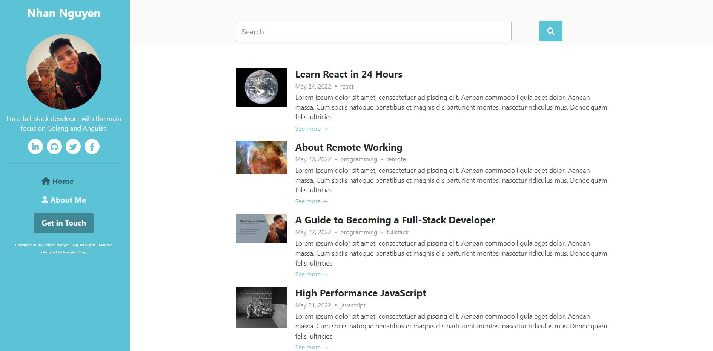

# ngx-scully-blog

**ngx-scully-blog** is a simple blog made for developers that is easy to setup, supports SEO, Google Adsense, Google Analytics, Facebook Pixel, and many more.

> Blogging on Notion, generating a static site with Angular, Scully, and hosting on Firebase.

Live demo: https://ngx-scully-blog-demo.web.app



## Getting started

Fork this project and then clone the forked project

```bash
git clone https://github.com/<your_username>/ngx-scully-blog.git && cd ngx-scully-blog
```

Install dependencies

```bash
npm install
```

Export the default Notion API key. This is the key I created for demo purposes, you will setup with your own Notion later.

```bash
export NOTION_API_KEY=secret_daYuK8nuNeFvxWrn0dIhDwZnGXyMN3fAdFG97gY5i3l
```

Run Scully

```bash
npm run scully:preview
```

The demo blog with default data will be available at [http://localhost:1668](http://localhost:1668)

## Make it your own

### Setup Firebase

- Go to [https://console.firebase.google.com](https://console.firebase.google.com) and login with your Google account.
- After login, click on **Add project** button to create a new project.
- Input your project name and click **Continue**.

  > **Note**: if your project id is `ngx-scully-blog-dem`, your blog address will be `https://ngx-scully-blog-demo.web.app`. You can setup your custom domain as well.

- Disable the option **Enable Google analytics for this project** and click **Create project**

### Setup Notion

- Register or login at [notion.so](https://notion.so)
- Create an integration at [notion.so/my-integrations](https://notion.so/my-integrations). Remember to copy the secret token!
- Create a Notion database with the same properties as [this database](https://ngx-scully-blog.notion.site/1711090f063e401fa0840b3ce44a757b?v=111d7e3df3b942e7ac25185c39503811) (or you can choose to duplicate this one)

  > - Title: Type Text
  > - Status: Type Select (Published, Unlisted, WIP, Deleted)
  > - Slug: Type Text (have no spaces)
  > - Description: Type Text
  > - Tags: Type Multi-select (create your own tags)
  > - Published At: Type Created time

- Go to the created database, and share it with the integration (Share → Select the integration in the Invite dropdown). Don’t forget the database id in the URL. It’s a series of characters after the last slash and before the question mark.
  > Here’s a reference: https://www.notion.so/{USER}/**{DATABASE_ID}**?{someotherirrelevantstuff} If you only have 1 ID before the question mark in the URL, then the first ID is the Database ID i.e. https://www.notion.so/**{DATABASE_ID}**?{OtherIdThatDoesNotMatter}

### Personalize your blog

- Update the config values in `ngx-scully-blog/src/app/config/site-configs.ts` file. I put comments for each config so you can read the comments if you need more information.
- Update favicon (`ngx-scully-blog/src/favicon.ico`)
- Update profile image (`ngx-scully-blog/src/assets/profile.jpg`)
- Update default cover image of the blog (`ngx-scully-blog/src/assets/default_share_img.jpg`)
- Replace the default database id with the id of the database you created (line 49 in `ngx-scully-blog/scully.ngx-scully-blog.config.ts` file)
- Export `NOTION_API_KEY` again with your intergration token (`export NOTION_API_KEY=your_integration_token` or update in your `.profile` file)

### Deploy your blog to Firebase

#### Login to Firebase

- Open your terminal and go to the project root directory.
- Let's install Firebase CLI globally: `npm install -g firebase-tools`
- Login to Firebase: `firebase login`
- Input `y` to let Firebase collect CLI usage and error reporting information, if not, input `n`
- A new browser window will be opened and you can login to Firebase here.
- Next, click on the "Allow" button to give Firebase CLI permissions to access to your Firebase account.

Then you would see a success page notify that you are logged in successfully.

Go back to your editor's terminal. You will see a successful message also.

#### Init your project

- In the previous terminal, run the command `firebase init` to initiate your project.
- Firebase CLI will ask: **Which Firebase CLI features do you want to set up for this directory? Press Space to select features, then Enter to confirm your choices**:

  - Use the arrow down key to move the cursor to **Hosting: Configure files for Firebase Hosting and (optionally) set up GitHub Action deploys** option.
  - Press Space to select this option.
  - Press Enter to continue.

- Project setup, Firebase CLI will ask you some questions:

  - Please select an option: Select **Use an existing project** option to use the Firebase project you created earlier and hit enter.
  - Select a default Firebase project for this directory: Select the project name you created earlier and hit enter.

- Hosting setup, Firebase CLI will ask you some questions:

  - What do you want to use as your public directory?: Input **dist/static** and hit enter.
  - Configure as a single-page app (rewrite all urls to /index.html)?: Input **n** for No and hit enter.
  - Set up automatic builds and deploys with GitHub?: Input **n** for No and hit enter.
  - File dist/static/404.html already exists. Overwrite?: Input **n** for No and hit enter.
  - File dist/static/index.html already exists. Overwrite?: Input **n** for No and hit enter.

Ok, now you are ready to deploy your blog to Firebase.

#### Deploy to Firebase hosting

In the previous terminal, inside the project root directory, run the command `npm run scully:deploy`

## How to write and publish a blog post

### Create a new post on Notion

- Open your database and create a new record
- Fill in all properties

  > **Note**:
  > - You have to fill in all the properties
  > - Only posts that have status `Published` will be listed on your blog home page

- Open the record and start to write your post content

### Important note on post images

Image links on Notion have expire time of one hour, you need to rebuild the blog to get new links each hour. To prevent that, you need to upload post images elsewhere like [Firebase storage](https://firebase.google.com/products/storage) or [Dropbox](https://www.dropbox.com) and then provide the links to Notion instead of uploading directly on the Notion app.

### Preview your blog on local

```bash
npm run scully:preview
```

### Deploy your new post to Firebase

```bash
npm run scully:deploy
```

## Advanced features

### Google analytics

Update configs in `ngx-scully-blog/src/app/config/advanced/google-analytics.ts` file.

### Google adsense

Update configs in `ngx-scully-blog/src/app/config/advanced/google-adsense.ts` file.

### Facebook pixel

Update configs in `ngx-scully-blog/src/app/config/advanced/facebook-pixel.ts` file.

### Enable comment for your blog

Update configs in `ngx-scully-blog/src/app/config/advanced/comment.ts` file.

### Manage menus

Update configs in `ngx-scully-blog/src/app/config/advanced/menus.ts` file.

### Logging errors

Update configs in `ngx-scully-blog/src/app/config/advanced/logging.ts` file.

### Advanced plugins

You can enable the Advanced plugins section in `ngx-scully-blog/scully.ngx-scully-blog.config.ts` file to support lazy load images, create a sitemap, create RSS feeds, minify HTML, optimize SEO href.
